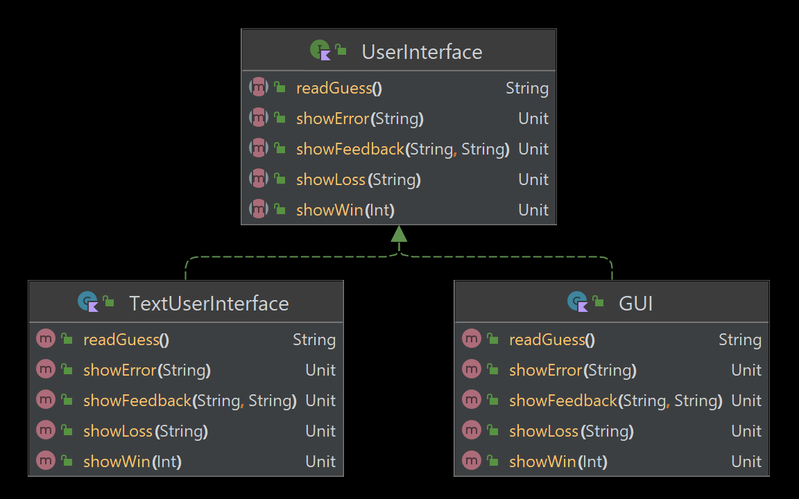
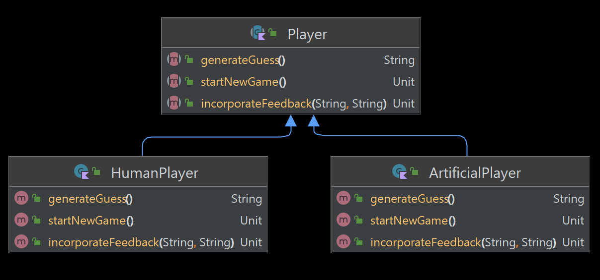

# Homework 10: Wordle Revisited

In this assignment, you will complete an implementation of Wordle that:

* allows repeating letters
* offers a choice between a text and graphical user interface
* implements an artificial intelligence solver
* uses the real Wordle dictionaries
    * [input-words.txt](data/dictionaries/input-words.txt) (14,855), words that are acceptable as guesses
    * [secret-words.txt](data/dictionaries/secret-words.txt) (2,317 words), from which the secret word is selected

It is designed to give you practice with interfaces and anonymous functions
created at run-time (similar to what we did in class on Thursday, November 10).

You are strongly advised to read this entire document before starting work.

## Setup

First, you should [play a game of Wordle](https://www.nytimes.com/games/wordle/index.html)
to learn or refresh yourself on its behavior.

Next, follow along with the
video [Homework 10 setting up run configurations](https://northeastern.hosted.panopto.com/Panopto/Pages/Viewer.aspx?id=32c07e97-0c6c-4944-8938-af4b001a8625)
to set up run configurations for the 4 versions of Wordle:

* GUI with HumanPlayer
* GUI with ArtificialPlayer
* TextInterface with HumanPlayer
* TextInterface with AI

These are the OS-specific VM arguments you should paste in:
* Windows: `-Dorg.openrndr.exceptions=JVM`
* Mac: `-Dorg.openrndr.exceptions=JVM -XstartOnFirstThread`


## Part 1: UserInterface

### Overview

This code has an interface named `UserInterface`,
which describes how the user interacts with the game.
You should read the KDoc in
[UserInterface.kt](src/main/kotlin/homework10/UserInterface.kt)
or generate and view it in a web browser.

You have been provided with the class `GUI`, which provides a complete graphical
implementation of `UserInterface`. You do not need to understand the code
in that file.

### TextUserInterface

You are responsible for completing the class [TextUserInterface](src/main/kotlin/homework10/TextUserInterface.kt),
which will provide a textual interface to the game (similar to the one
in Homework 4). Guidance appears in the source code.

### Transcript
Create a transcript (or append multiple transcripts) showing at least one win and at least one loss with the
`TextUserInterface (human)` run configuration. This will go into `Summary.txt`.

## Part 2: Player



### Overview
There is a `Player` interface, with two implementations, `HumanPlayer` and `ArtificialPlayer`.
`HumanPlayer` is complete, but you need to implement `ArtificialPlayer`.

### ArtificialPlayer

Here's an overview of how `ArtificialPlayer` will work:

1. It reads in [input-words.txt](data/dictionaries/input-words.txt), which contains all of the words permitted as
   guesses in Wordle.
2. It has a private mutable list `constraints` that holds a list of predicates that take a single String argument and
   return a `Boolean` indicating whether the word satisfies the constraint.
3. Its first guess is simply the first word in its list of legal words.
4. When it gets a response for its guess, it adds constraints. For example, if its guess was "WORLD" and it received the
   feedback "*+...", it would add these constraints:
    * The letter "W" is the first character of the secret word.
    * The letter "O" is not the second character but is somewhere in the secret word.
    * The letter "R" is not in the secret word.
    * The letter "L" is not in the secret word.
    * The letter "D" is not in the secret word.
5. For its next guess, it would choose the first word in its list that satisfies all the constraints.

Further instructions appear in [ArtificialPlayer.kt](src/main/kotlin/homework10/ArtificialPlayer.kt).
You may find the [first() method](https://kotlinlang.org/api/latest/jvm/stdlib/kotlin.collections/first.html) helpful.
It is a higher-order function that returns the first element of the receiver list that satisfies a predicate.
See [sample use](https://pl.kotl.in/oM2mzp_fC).

### Warning
There is a tricky situation you need to watch out for that involves repeated letters in a guess.
Consider these conditions:

```
secret word:  HORSE
guess:        HOHOS
match string: **..+
index:        01234
```
Going character by character, you might:
0. Add a constraint that the first character must be "H". This is correct.
1. Add a constraint that the second character must be "O". This is correct.
2. Add a constraint that "H" does not appear. This is **wrong**. The `.` at position 2
   in the match string means that there is not a *second* "H".

~~I advise you not to try to be too clever. It's fine to not generate a constraint
for indices where both (1) the match string has a `.` and (2) the guess has a letter that
appears elsewhere in the guess.~~

### Update

Tricky cases were discussed in class on Monday, November 14. With that assistance, you now need to catch all of them to 
get full credit. You are encouraged to get help if it would be useful. A helper (outside of your team) must not specify
how to code it and should not tell you how to solve the problem but can help you figure out a solution.

### Transcript

Create a transcript (or append multiple transcripts) showing at least one win ~~~and at least one loss~~~ with the
`TextUserInterface (ai)` run configuration with random words. Also create a transcript
where you force the secret word to be "WORSE". The transcripts will go into `Summary.txt`.

## Tips

For testing and debugging, you might want to temporarily make one or
both of these changes to  [WordleGame.kt](src/main/kotlin/homework10/WordleGame.kt):

* Change `playGame()` so it always uses the same secret word
  (or always prints it at the start of the game).
* Change the constant `MAX_TURNS` to give yourself more turns. I only recommend doing this with `TextUserInterface`.

You can improve the performance of the AI by:

* Manual reordering words in [input-words.txt](data/dictionaries/input-words.txt) so words with the most common
  letters are at the start.
* Have `ArtificialPlayer` gets its candidate words from [secret-words.txt](data/dictionaries/secret-words.txt),
  so it only guesses words that are possible solutions.

## Optional challenge

Modify the game so guesses not in [input-words.txt](data/dictionaries/input-words.txt)
are rejected, as they are in the real Wordle game. It shouldn't be too hard
to get this to work with `TextUserInterface`, but I do not recommend trying
to get it to work with `GraphicalUserInterface`.

## Submission

You should submit PDFs of 3 files:

* `TextUserInterface.kt`
* `ArtificialPlayer.kt`
* `Summary.txt`

Please print the files in _landscape mode_ rather than portrait code, which I've
realized works better for code. As always, you should run the formatter over your files.
